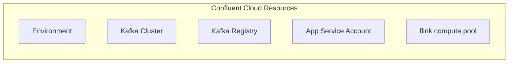

# Confluent Cloud Infrastructure

This Terraform configuration creates or reuses Confluent Cloud infrastructure resources including:
- Environment
- Kafka Cluster
- Schema Registry (auto-provisioned with ADVANCED governance)
- Service Account



## Pre-requisites

- Terraform >= 1.3.0
- Confluent Cloud account with API credentials for a `tf_runner` service account.

## Usage

### Creating New Resources (Default)

By default, this configuration will create new resources. Simply run:

```bash
terraform init
terraform plan
terraform apply
```

### Reusing Existing Resources

To reuse existing Confluent Cloud resources, set the following variables in your `terraform.tfvars`:

```hcl
# Reuse existing environment (by ID or name - use only one)
existing_environment_id = "env-xxxxx"
# OR
existing_environment_name = "my-environment"

# Reuse existing Kafka cluster
existing_kafka_cluster_id = "lkc-xxxxx"

# Reuse existing Schema Registry
existing_schema_registry_id = "lsrc-xxxxx"

# Reuse existing service account
existing_service_account_id = "sa-xxxxx"

# Reuse existing compute pool
existing_flink_compute_pool_id = "lfcp-xxxxx"
```

### What is created

When creating new resources (default behavior):
- A new Confluent Cloud environment with ADVANCED stream governance
- A new Standard Kafka cluster
- A new service account
- Schema Registry provisioned in the environment
- Flink Compute Pool

When reusing existing resources:
- Only resources not specified in `terraform.tfvars` will be created
- Existing resources will be referenced via data sources
