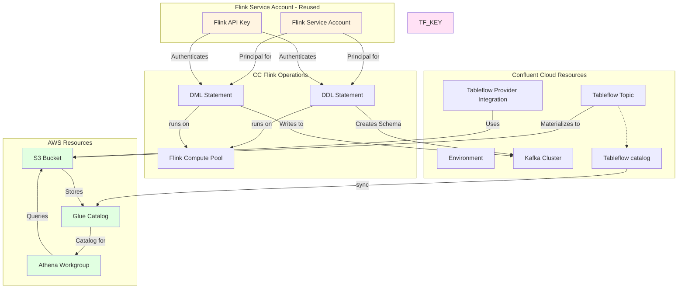

# Tableflow Configuration for Transaction Enriched Topic

This Terraform configuration enables Confluent Tableflow on a single Kafka topic (transaction enriched) to automatically materialize it as an Iceberg table in S3.

## Overview

Tableflow automatically manages Iceberg tables from Kafka topics. This configuration enables Tableflow on the `tx_enriched` topic (or any topic you specify).

## Service Accounts and Authentication

This configuration uses multiple service accounts and API keys for different purposes:



### Service Account Roles

1. **Confluent Cloud API Key** (`CONFLUENT_CLOUD_API_KEY`)
   - Used by Terraform provider to create and manage Confluent resources
   - Required for: Environment, Kafka Cluster, Flink Compute Pool, Tableflow resources

2. **Flink Service Account** (`flink_service_account_id`) - **REUSED FOR MULTIPLE OPERATIONS**
   - **Single service account reused for:**
     - **Flink App Management**: Managing Flink applications and statements
     - **Deployment Operations**: Deploying and managing Flink compute pools
     - **Compute Pool Operations**: Operations on Flink compute pools
     - **Statement Principal**: Flink statements run as this service account
   - Must have permissions to:
     - Read/write to Kafka topics
     - Access Schema Registry
     - Manage Flink compute pools
     - Create and manage Flink statements
   - **Flink API Key** (`flink_api_key` / `flink_api_secret`): API key associated with this service account
     - Used to authenticate all Flink operations (deployment, app management, statements)
     - Should be created from the `flink_service_account_id` service account
   - **Note**: The legacy variable `app_manager_service_account_id` is still supported for backward compatibility but will be deprecated. Use `flink_service_account_id` instead.

3. **Tableflow API Key** (`tableflow_api_key` / `tableflow_api_secret`)
   - Used by Tableflow service to enable Tableflow on topics
   - Required for: Enabling Tableflow on Kafka topics


## Prerequisites

1. **Confluent Cloud Account** with:
   - An environment
   - A Kafka cluster
   - Tableflow provider integration configured (BYOB AWS)
   - S3 bucket for Iceberg storage
   - Tableflow API key and secret

2. **Terraform** >= 1.3.0

3. **Confluent Cloud API Credentials**:
   ```bash
   export CONFLUENT_CLOUD_API_KEY="your-api-key"
   export CONFLUENT_CLOUD_API_SECRET="your-api-secret"
   ```

## Configuration Options

### Option 1: Use Remote State from IaC (Recommended)

If you have an existing IaC setup that outputs the required values:

1. Copy the example variables file:
   ```bash
   cp terraform.tfvars.example terraform.tfvars
   ```

2. Set the path to your IaC state file:
   ```hcl
   iac_state_path = "../../IaC/terraform.tfstate"
   ```

3. Configure the topic name:
   ```hcl
   topic_name = "tx_enriched"
   ```

The configuration will automatically read:
- `confluent_environment_id`
- `kafka_cluster_id`
- `s3_bucket_name`
- `tableflow_provider_integration_id`
- `tableflow_api_key`
- `tableflow_api_secret`
- `flink_service_account_id` (or `app_manager_service_account_id` for backward compatibility)
- `flink_api_key`
- `flink_api_secret`

### Option 2: Direct Configuration

If you're not using remote state, provide all values directly:

1. Copy the example variables file:
   ```bash
   cp terraform.tfvars.example terraform.tfvars
   ```

2. Set `iac_state_path` to empty string:
   ```hcl
   iac_state_path = ""
   ```

3. Fill in all required variables:
   ```hcl
   confluent_environment_id = "env-xxxxx"
   kafka_cluster_id         = "lkc-xxxxx"
   s3_bucket_name           = "my-iceberg-bucket"
   tableflow_provider_integration_id = "cpi-xxxxx"
   tableflow_api_key        = "xxxxx"
   tableflow_api_secret     = "xxxxx"
   topic_name               = "transaction_enriched"
   
   # Flink service account (reused for app management, deployment, and compute pool)
   flink_service_account_id = "sa-xxxxx"
   flink_api_key            = "xxxxx"  # API key from flink_service_account_id
   flink_api_secret         = "xxxxx"  # API secret from flink_service_account_id
   ```

## Usage


```bash
# initialize Terraform
terraform init
# 
terraform plan
terraform apply
terraform output
```

## Important Notes

- **Topic Schema**: The topic must have a schema registered in Schema Registry before Tableflow can materialize it. If the topic is created by Flink DDL statements, ensure those are deployed first.

- **Dependencies**: Tableflow requires:
  - The topic to exist
  - Schema to be registered for the topic
  - S3 bucket with proper permissions
  - Tableflow provider integration configured

- **Topic Creation**: This configuration does not create the Kafka topic. The topic must exist before enabling Tableflow. If your topic is created by Flink, ensure Flink statements are deployed first.

## Outputs

After applying, you can view outputs:

```bash
terraform output
```

Available outputs:
- `tableflow_enabled`: Whether Tableflow is enabled
- `tableflow_topic_name`: The topic name with Tableflow enabled
- `tableflow_topic_id`: The Tableflow topic resource ID
- `s3_bucket_name`: S3 bucket used for Iceberg storage
- `tableflow_provider_integration_id`: Provider integration ID
- `flink_service_account_id`: Flink service account ID (reused for app management, deployment, and compute pool)
- `flink_compute_pool_id`: Flink compute pool ID (created or provided)
- `flink_compute_pool_name`: Flink compute pool display name (if created)
- `ddl_statement_id` / `ddl_statement_name`: DDL Flink statement details
- `dml_statement_id` / `dml_statement_name`: DML Flink statement details
- `glue_database_name` / `glue_database_arn`: Glue catalog database details
- `athena_workgroup_name` / `athena_workgroup_arn`: Athena workgroup details
- `athena_query_results_location`: S3 location for Athena query results

## Troubleshooting

### Error: Topic not found
- Ensure the topic exists in your Kafka cluster
- Verify the topic name is correct

### Error: Schema not found
- Register a schema for the topic in Schema Registry
- If using Flink, ensure DDL statements are deployed first

### Error: Provider integration not found
- Verify the provider integration ID is correct
- Ensure the provider integration is configured in Confluent Cloud

### Error: S3 bucket access denied
- Verify the IAM role used by the provider integration has S3 permissions
- Check bucket name is correct

## Reference

Based on the implementation from `cc-cdc-tx-demo`, this configuration provides a simplified setup for enabling Tableflow on a single topic.
