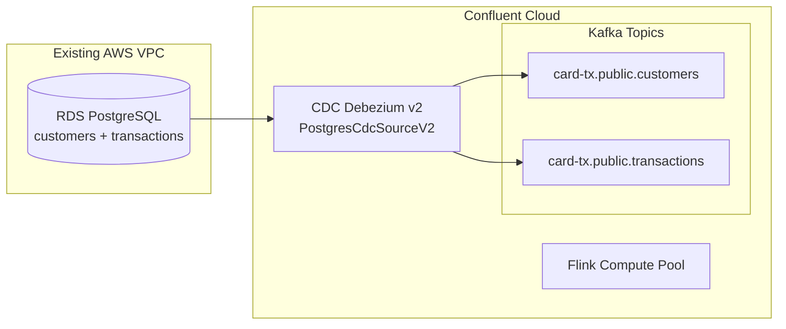

# Debezium CDC Connector from RDS Postgresql Database

This terraform is based on the transaction [end-to-end demonstration]()

## Component List

| Component | Description | Resource Naming |
|-----------|-------------|-----------------|
| RDS PostgreSQL | Database with customers and transactions tables | `card-tx-db-{id}` |
| VPC | Existing VPC (passed via terraform variable) | N/A |
| CDC Debezium v2 | Source connector capturing changes from PostgreSQL | `card-tx-cdc-source` |
| Flink Compute Pool | Processing Debezium messages, enrichment, aggregations | `card-tx-compute-pool-{id}` |

