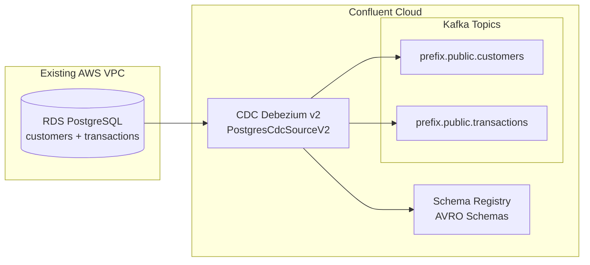
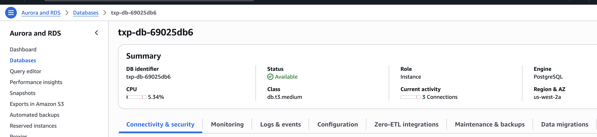

# Debezium CDC Connector from RDS PostgreSQL Database

This Terraform configuration creates an RDS PostgreSQL instance with `customers` and `transactions` tables, and a Confluent Cloud Debezium v2 connector to capture change data from PostgreSQL to Kafka topics.

This terraform is based on the transaction/customer [end-to-end demonstration](https://github.com/jbcodeforce/flink-studies/blob/master/e2e-demos/cc-cdc-tx-demo/README.md).

## Architecture



**Audience:** SRE to understand infrastructure settings

## Component List

| Component | Description | Resource Naming |
|-----------|-------------|-----------------|
| RDS PostgreSQL | Database with customers and transactions tables | `{prefix}-db-{id}` |
| VPC | Existing VPC (passed via terraform variable) | N/A |
| Security Group | Allows PostgreSQL access from Confluent Cloud IPs | `{prefix}-db-sg-{id}` |
| CDC Debezium v2 | Source connector capturing changes from PostgreSQL | `{prefix}-cdc-source` |
| Confluent Environment | Confluent Cloud environment with ADVANCED governance | `{prefix}-environment-{id}` |
| Kafka Cluster | Standard Kafka cluster in Confluent Cloud | `{prefix}-cluster-{id}` |
| Schema Registry | Auto-provisioned with ADVANCED governance package | Auto-created |

## Prerequisites

1. **AWS Account** with:
   - Existing VPC with subnets
   - AWS CLI configured with appropriate credentials
   - IAM permissions to create RDS instances, security groups, and subnet groups

2. **Confluent Cloud Account** with:
   - API Key and Secret for service account with FlinkAdmin and EnvironmentAdmin role
   - Access to create environments, clusters, and connectors

3. **Local Tools**:
   - Terraform >= 1.3.0
   - PostgreSQL client (`psql`) - optional, for automatic table creation
   - `curl` - for schema cleanup operations

## Configuration

### 1. Copy the example variables file

```bash
cd IaC
cp terraform.tfvars.example terraform.tfvars
```

### 2. Edit `terraform.tfvars`

Required variables:
- `prefix`: Prefix for all resource names (default: `cdc-postgres`)
- `owner_email`: Your email for resource tagging
- `existing_vpc_id`: Your existing AWS VPC ID
- `db_password`: Secure password for PostgreSQL database
- `confluent_cloud_api_key`: Your Confluent Cloud API key
- `confluent_cloud_api_secret`: Your Confluent Cloud API secret

Optional variables:
- `existing_subnet_ids`: List of subnet IDs (auto-discovered if not provided)
- `db_instance_class`: RDS instance class (default: `db.t3.medium`)
- `db_allocated_storage`: Storage in GB (default: 100)
- `db_publicly_accessible`: Whether RDS is publicly accessible (default: `true`)
- `create_tables_automatically`: Auto-create tables using psql (default: `true`)
- `db_allowed_cidr_blocks`: Additional CIDR blocks for RDS access
- `confluent_cloud_cidr_blocks`: Confluent Cloud connector egress IPs
- `app_manager_sa_id`: Existing Confluent service account ID for app manager (optional - creates new if not provided)
- `connectors_sa_id`: Existing Confluent service account ID for connectors (optional - creates new if not provided)

### 3. Update Confluent Cloud IPs

The default `confluent_cloud_cidr_blocks` includes common Confluent Cloud connector egress IPs. For production, you should:

1. Get the actual egress IPs from your Confluent Cloud connector:
   - Go to Confluent Cloud UI → Connectors → Your Connector → Networking
   - Or check: https://docs.confluent.io/cloud/current/networking/ip-ranges.html

2. Update `confluent_cloud_cidr_blocks` in `terraform.tfvars` with your specific IPs

## Usage

### Initialize Terraform

```bash
cd IaC
terraform init
```

### Plan the deployment

```bash
terraform plan
```

Review the plan to ensure all resources will be created correctly.

### Apply the configuration

```bash
terraform apply
```

This will create:
1. RDS PostgreSQL instance with logical replication enabled
2. Security group allowing access from Confluent Cloud IPs
3. Database tables (`customers` and `transactions`)
4. Confluent Cloud environment and Kafka cluster
5. Schema Registry (auto-provisioned)
6. Service accounts and API keys (or reuse existing if `app_manager_sa_id`/`connectors_sa_id` are provided)
7. Debezium v2 CDC connector

### Add records to Postgres tables

Use the python code from [e2e-demos/cc-cdc-tx-demo/data-generators/](https://github.com/jbcodeforce/flink-studies/blob/master/e2e-demos/cc-cdc-tx-demo/data-generators/) with a command like:

```sh
 uv run generate_test_data.py --db-host txp-db-.....cnd....us-west-2.rds.amazonaws.com --db-name txp-db --db-user postgres   --db-password ZutAlors123!
```

or to run until stopped:
```sh
 uv run generate_test_data.py --db-host txp-db-.....cnd....us-west-2.rds.amazonaws.com --db-name txp-db --db-user postgres   --db-password ZutAlors123! --run-forever
```

### Verify the setup

After deployment, verify:

1. **RDS Instance**:
   ```bash
   terraform output rds_endpoint
   terraform output rds_address
   ```

2. **Kafka Topics** (created automatically by the connector when records are added to RDS):
   - `{prefix}.public.customers`
   - `{prefix}.public.transactions`

3. **Schema Registry Subjects** (created automatically):
   - `{prefix}.public.customers-key`
   - `{prefix}.public.customers-value`
   - `{prefix}.public.transactions-key`
   - `{prefix}.public.transactions-value`

4. **Connector Status**:
   - Check in Confluent Cloud UI → Connectors
   - Verify connector is running and capturing changes


## Verify resources in the Consoles

### Within AWS Console

* RDS Created

   

### Within Confluent Console

* Environment

* Kafka Clusters
   

* Connectors
   

* Topics
   

* Created Schemas
   


### Test the CDC pipeline

1. **Insert test data** into PostgreSQL:
   ```bash
   psql -h $(terraform output -raw rds_address) \
        -U $(terraform output -raw rds_database_name) \
        -d postgresdb
   ```

   ```sql
   INSERT INTO customers (account_number, customer_name, email, city)
   VALUES ('ACC001', 'John Doe', 'john@example.com', 'New York');

   INSERT INTO transactions (txn_id, account_number, amount, merchant, status)
   VALUES ('TXN001', 'ACC001', 100.50, 'Amazon', 'COMPLETED');
   ```

2. **Verify messages in Kafka**:
   - Use Confluent Cloud UI → Topics → `{prefix}.public.customers`
   - Or use `kafka-console-consumer` with Confluent Cloud credentials

### Destroy resources

```bash
terraform destroy
```

**Note**: Schema Registry schemas are automatically cleaned up during destroy. If destroy fails, you may need to manually delete schemas using the Schema Registry API.

## Database Schema

The Terraform creates two tables:

### Customers Table
- `account_number` (VARCHAR, PRIMARY KEY)
- `customer_name` (VARCHAR)
- `email` (VARCHAR)
- `phone_number` (VARCHAR)
- `date_of_birth` (TIMESTAMP)
- `city` (VARCHAR)
- `created_at` (TIMESTAMPTZ)

### Transactions Table
- `txn_id` (VARCHAR, PRIMARY KEY)
- `account_number` (VARCHAR, FOREIGN KEY → customers)
- `timestamp` (TIMESTAMPTZ)
- `amount` (DECIMAL)
- `currency` (VARCHAR, default: 'USD')
- `merchant` (VARCHAR)
- `location` (VARCHAR)
- `status` (VARCHAR, default: 'PENDING')
- `transaction_type` (VARCHAR)

## Service Account Reuse

This Terraform configuration supports reusing existing Confluent Cloud service accounts:

- **App Manager Service Account**: Set `app_manager_sa_id` to reuse an existing service account with EnvironmentAdmin role
- **Connectors Service Account**: Set `connectors_sa_id` to reuse an existing service account for CDC connectors

If these variables are not set, new service accounts will be created automatically with the appropriate roles and permissions.

**Note**: When reusing existing service accounts, ensure they have the required permissions:
- App Manager SA: `EnvironmentAdmin` role on the environment
- Connectors SA: Kafka ACLs for CREATE, WRITE, READ on topics, DESCRIBE on cluster, and READ on consumer groups

## IAM Role and Policy Reuse

This Terraform configuration assumes you have existing IAM roles and policies that can be reused. The variables `iam_role_arn` and `iam_policy_arn` are provided for future use if needed for additional AWS integrations (e.g., S3, Glue).

Currently, the configuration:
- **Does NOT create IAM roles** - assumes existing roles are available
- **Does NOT create IAM policies** - assumes existing policies are available
- **Uses existing VPC and subnets** - passed via `existing_vpc_id` and optionally `existing_subnet_ids`


## Troubleshooting

### Connector fails to connect to RDS

1. **Check Security Group**: Verify Confluent Cloud IPs are in the security group
   ```bash
   terraform output rds_allowed_cidr_blocks
   ```

2. **Check RDS Endpoint**: Verify the endpoint is correct
   ```bash
   terraform output rds_endpoint
   ```

3. **Test Connection**: Try connecting manually
   ```bash
   psql -h $(terraform output -raw rds_address) -U postgres -d postgresdb
   ```

### Tables not created automatically

If `create_tables_automatically = true` but tables aren't created:

1. **Check psql installation**:
   ```bash
   which psql
   ```

2. **Install psql**:
   - macOS: `brew install postgresql`
   - Ubuntu: `sudo apt-get install postgresql-client`
   - RHEL: `sudo yum install postgresql`

3. **Create tables manually**:
   ```bash
   psql -h $(terraform output -raw rds_address) \
        -U postgres \
        -d postgresdb \
        -f schema.sql
   ```

### Schema Registry cleanup fails

If schema cleanup fails during destroy:

1. **Set environment variables**:
   ```bash
   export SCHEMA_REGISTRY_ENDPOINT=$(terraform output -raw confluent_schema_registry_endpoint)
   export SCHEMA_REGISTRY_KEY_ID=$(terraform output -raw schema_registry_api_key)
   export SCHEMA_REGISTRY_API_SECRET=$(terraform output -raw schema_registry_api_secret)
   ```

2. **Manually delete schemas** using the Schema Registry API or Confluent Cloud UI


## References

- [Confluent Cloud Flink Documentation](https://docs.confluent.io/cloud/current/flink/overview.html)
- [Confluent Cloud Connectors](https://docs.confluent.io/cloud/current/connectors/overview.html)
- [Debezium PostgreSQL Connector](https://debezium.io/documentation/reference/stable/connectors/postgresql.html)
- [Confluent Cloud IP Ranges](https://docs.confluent.io/cloud/current/networking/ip-ranges.html)
- [Jerome Boyer's Flink Studies](https://jbcodeforce.github.io/flink-studies/)