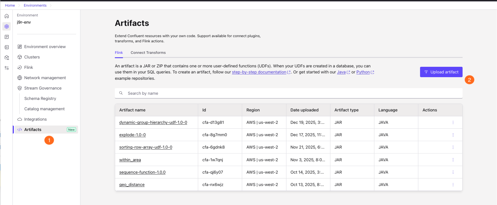
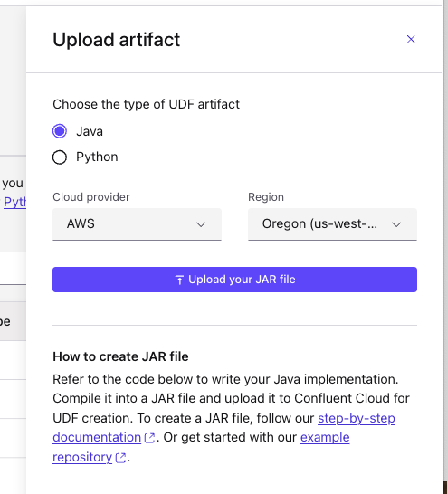

# Explode Function UDF for Confluent Cloud Flink

[This User Defined Function (UDF)](https://github.com/jbcodeforce/flink-udfs-catalog/tree/main/explode) generates a sequence of string as row from a list of string, the goal of this lab is to demonstrate how to deploy it on Confluent Cloud or Integrate it on Confluent Platform for Flink.

See [Create a User Defined Function for Flink SQL" here for more details](https://docs.confluent.io/cloud/current/flink/how-to-guides/create-udf.html#flink-sql-create-udf-upload-jar)

## Usage

The EXPLODE function generates a row per string in the list or array of strings provided as input. It can be used in combination with JOIN LATERAL to generate rows in Flink SQL.

### Example Usage with Confluent Cloud SQL Flink

```sql
-- Generate a 
SELECT 
 t.sub_string 
from lateral table(EXPLODE(ARRAY['ab','bc','cd'])) AS t(sub_string);
```

## 1- Building the UDF

1. Clone the UDF repository
    ```sh
    git clone https://github.com/jbcodeforce/flink-udfs-catalog.git
    ```
1. Be sure to have JAVA (21+) and [Maven](https://maven.apache.org/install.html) installed.
1. Build the UDF JAR file
    ```bash
    cd explode
    mvn clean package
    ```
    
    The JAR file will be created in the `target` directory.

## 2- Deploying to Confluent Cloud step by step

[See Confluent cloud product documentation.](https://docs.confluent.io/cloud/current/flink/concepts/user-defined-functions.html)

### Prerequisites

* Be sure to have a user or service account with FlinkDeveloper RBAC to be able to manage workspaces and artifacts
* Install and configure the [Confluent CLI](https://docs.confluent.io/confluent-cli/current/install.html)
* Log in to Confluent Cloud:
  ```sh
  confluent login
  ```

### Upload the UDF Artifact

#### Option 1:  Using Confluent CLI Directly

```sh
confluent environment list
# then in your environment in the CLI
confluent flink artifact create explode-udf \
  --artifact-file target/explode-1.0-0.jar \
  --cloud aws \
  --region us-west-2 \
  --environment env-abc123
```

#### Option 2: Using Confluent Cloud user interface

* From you Confluent Cloud Environment: 1/ select Artifacts 2/ Upload artifact
    

* Select the UDF artifact type (Java), the Cloud provider and the region
    

* The artifact is part of the table now.

#### Option 3: Using Terraform

Use Terraform to deploy the UDF artifact and automatically register the function.

**Prerequisites:**
- [Terraform](https://www.terraform.io/downloads) installed (>= 1.0)
- Confluent Cloud API credentials
- Flink API credentials (for function registration)
- Built JAR file from the previous step

**Steps:**

1. Navigate to the IaC directory:
   ```sh
   cd IaC
   ```

2. Copy the example variables file and configure it:
   ```sh
   cp terraform.tfvars.example terraform.tfvars
   # Edit terraform.tfvars with your values
   ```

3. Configure the required variables in `terraform.tfvars`:
   - `confluent_cloud_api_key` and `confluent_cloud_api_secret`: Your Confluent Cloud API credentials
   - `organization_id` and `environment_id`: Your Confluent Cloud organization and environment IDs
   - `artifact_file`: Path to the built JAR file (e.g., `../../../flink-udfs-catalog/explode/target/explode-1.0-0.jar`)
   - `cloud_provider` and `cloud_region`: Your cloud provider and region
   - `current_catalog` and `current_database`: Your Flink catalog and database names
   - `flink_compute_pool_id`, `flink_rest_endpoint`, `flink_api_key`, `flink_api_secret`, `flink_principal_id`: Flink configuration

4. Initialize Terraform:
   ```sh
   terraform init
   ```

5. Review the deployment plan:
   ```sh
   terraform plan
   ```

6. Apply the configuration:
   ```sh
   terraform apply
   ```

7. After successful deployment, Terraform will output:
   - Artifact ID and version
   - SQL statement to create the function (if not auto-created)
   - Usage example

**Note:** The Terraform configuration automatically creates the `EXPLODE` function in your Flink catalog. If you prefer to register it manually, you can comment out the `confluent_flink_statement` resource in `main.tf` and use the output SQL statement.

### Register the Function

If you didn't use Terraform (which auto-registers the function), declare the function in the Catalog using SQL in the Confluent Cloud Workspace:

Declare the function in the Catalog using SQL in the Confluent Cloud Workspace:

```sql
CREATE FUNCTION EXPLODE
AS
'io.confluent.udf.ExplodeFunction'
USING JAR 'confluent-artifact://<artifact-id>';
```

Replace `<artifact-id>` with the artifact ID returned from the upload command.
